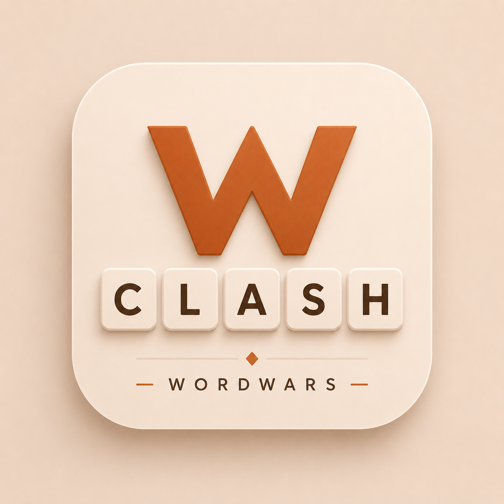

# WordWars

Competitive multiplayer Wordle — the host sets the word and category,
players race to solve it. Scoring is based on speed and guess
efficiency. Built with Node.js, Express, and Socket.io.

## Prerequisites
- Node.js 20+
- Git
- GitHub CLI — https://cli.github.com
- Railway CLI — npm install -g @railway/cli
- Railway account — https://railway.app

## One-Time Setup
  chmod +x setup.sh
  ./setup.sh

## How CI/CD Works
  Push to main
    → GitHub Actions: syntax check + health check (~30s)
    → Railway: Nixpacks build + deploy (~2 min)
    → Zero-downtime rollover via healthcheck
  Total: ~2-3 minutes from git push to live

## Local Development
  npm install
  cp .env.example .env   # then fill in real values
  node server.js
  # Open http://localhost:3000

## Environment Variables
  PORT           → Injected by Railway automatically. Do not set.
  ALLOWED_ORIGIN → Default: * (dev only). In production set it to your Railway
                   domain; if unset it falls back to RAILWAY_PUBLIC_DOMAIN.
  MW_API_KEY     → Required in production (server exits if unset). Merriam-Webster
                   Collegiate Dictionary API key.
                   Get a free key at https://dictionaryapi.com/register/index
                   Set in Railway Dashboard → Service → Variables
  REDIS_URL      → Optional but recommended. When set, active games AND user
                   accounts/sessions are stored in Redis and survive a
                   redeploy/restart. Unset = in-memory only (accounts reset on
                   restart). Add a Railway Redis service and reference its REDIS_URL.
  Email delivery → Passwordless sign-in (magic links) needs an email provider.
                   Joining a room never needs sign-in. Pick ONE provider:
                   • RESEND_API_KEY (+ MAIL_FROM)  → preferred; Resend HTTP API.
                   • SMTP_HOST/PORT/SECURE/USER/PASS/SMTP_FROM → SMTP fallback.
                   Full step-by-step: docs/AUTH_SETUP.md
  REQUIRE_HOST_AUTH → Whether hosting a room requires sign-in. Unset (default) =
                   required only once email is configured, so hosting stays OPEN
                   while you set email up. true = always; false = never.
  PUBLIC_BASE_URL→ Optional. Base URL used to build magic-link URLs. Defaults to the
                   request host (correct behind Railway's proxy).

## Useful Commands
  railway logs      # tail live logs
  railway domain    # get your public URL
  railway rollback  # revert to previous deploy
  npm test          # run smoke tests (health, socket handshake, env checks)

## Persistence & Redeploys
  Set REDIS_URL (e.g. a Railway Redis service) and active games survive a
  redeploy/restart: room state is snapshotted to Redis every few seconds and on
  shutdown, and restored on boot — players auto-reconnect into their round.
  On SIGTERM the server also broadcasts a "server is updating" notice so players
  get a clear heads-up during the brief swap.

  Without REDIS_URL the server runs in-memory only: a redeploy/restart clears all
  active games (players are dropped to a fresh game). Brief client/network drops
  are always recovered via socket reconnection regardless of Redis.

## Estimated Cost
  ~$5-10/month on Railway Hobby plan
